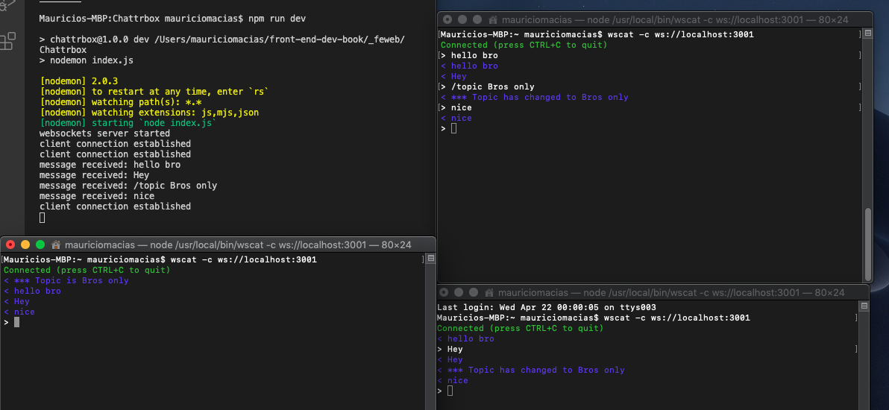

# CoffeeRunWithFirebase
The Entire CoffeeRun Project with Firebase for the backend

# Directions
(1) Finish Chapter 15
(2) Complete the Bronze Challenge: Creating a Custon Error Page with app/error.html with a picture of a cat from https://http.cat/404
(3) Complete the Silver Challenge: Providing a MIME Type Dynamically. All the test MIMES are in app/ directory.
(4) Finish Chapter 16
(5) Add a /topic command to the chat server to track what users are discussing in the chat. If any user types a string like this:
 /topic Chatting about WebSockets
All connected users should receive this string:
*** Topic has changed to 'Chatting about WebSockets'
Users who are not connected should not see this message (i.e., the /topic command should
not be saved in the array of previous messages to be sent to each  user.)
Instead, the first message that newly connected users should receive is the current topic:
*** Topic is 'Chatting about WebSockets'
Newly connected users should then receive all the previous messages. 
    
